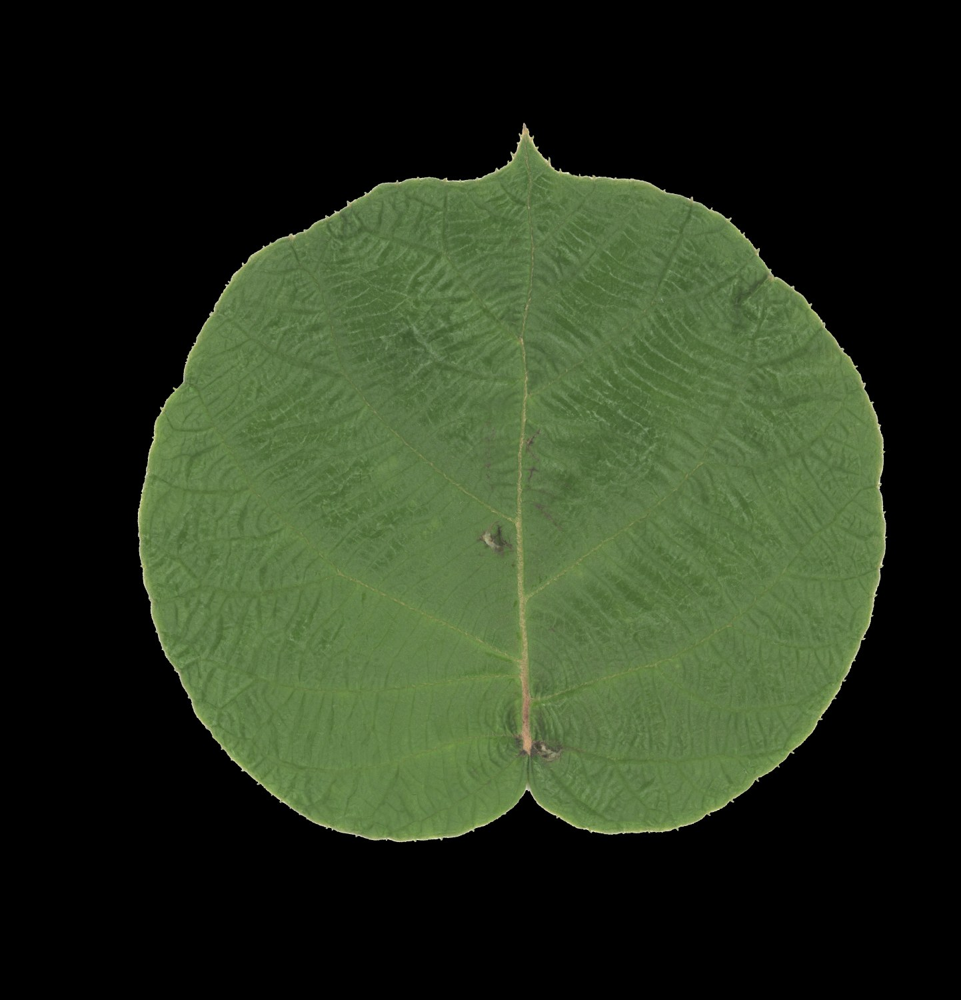
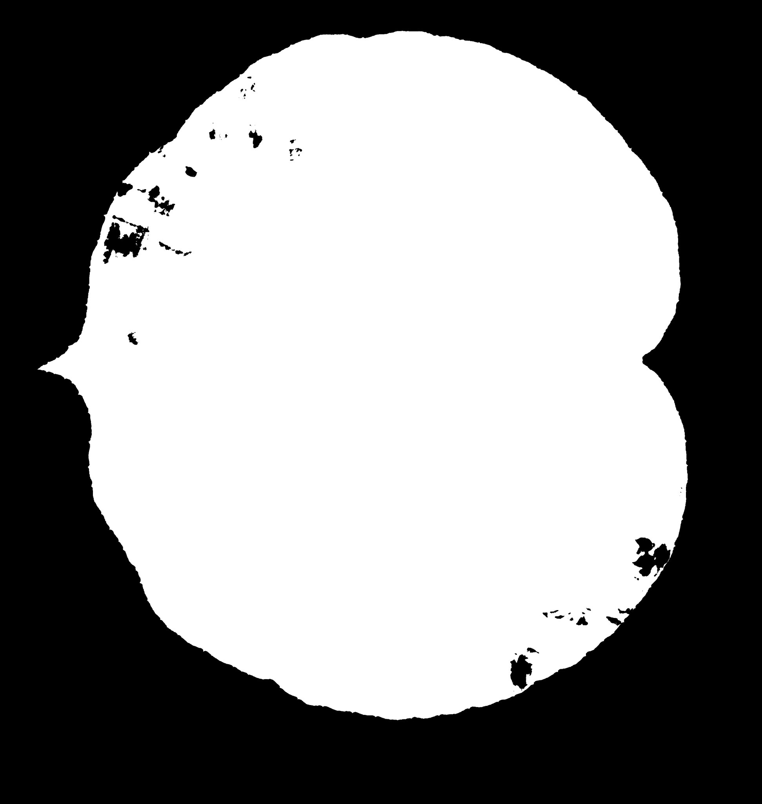

<div align="center">

# LUMEN-PS

### Turn a flatbed scanner into a photometric-stereo material scanner.

Recover **normal maps, albedo, height, and alpha** from four ordinary scans—no camera rig, synchronized lights, or special optics.


*A real 1200 dpi Kiwi leaf reconstruction, relit through 360°. The animation uses the same normal-map lighting equation as the interactive viewer.*

</div>

> [!IMPORTANT]
> LUMEN-PS began as a foliage scanner, but the method is not leaf-specific. It can recover shallow surface relief from paper, fabric, bark, pressed flowers, prints, cardboard, and other mostly diffuse subjects. Very shiny or mirror-like materials—such as polished coins—break the lighting model. Use caution with any rigid object: a raised, heavy, sharp, or oversized object can scratch or crack the scanner glass or damage the lid/mechanism.

## The idea in one minute

A flatbed scanner already contains a stable moving light and a calibrated line sensor. They sit very close together, but crucially they are **not perfectly coaxial**. That tiny offset makes one side of a microscopic bump brighter than the other. The scanner therefore captures a real, repeatable lighting direction—not just color.


The lamp remains fixed in scanner coordinates. Rotate the subject by 90° between scans and the light appears to orbit it in subject coordinates. After the four images are aligned, each pixel has four measured intensities under four known light directions. That is enough to separate surface orientation from base color.


<p align="center"></p>

## From scans to a relightable material

| Stage | What happens | Why it matters |
|:--|:--|:--|
| **1 · Capture** | Scan at 0°, 90°, 180°, and 270° with identical exposure and color settings. | Produces four observations with different subject-relative light azimuths. |
| **2 · Linearize** | Undo sRGB gamma and optionally divide by a blank-card flat field. | Photometric stereo requires pixel values proportional to received light. |
| **3 · Register** | De-rotate using fiducials, refine rigid alignment, then correct small elastic changes. | The same output pixel must represent the same physical point in all four scans. |
| **4 · Calibrate** | Fit lamp azimuth and elevation from a calibration card or from re-render error. | The light elevation controls how strongly recovered normals tilt. |
| **5 · Solve** | Robustly solve `I = ρ(N · L)` per pixel, dropping highlight/shadow outliers. | Separates lighting-free albedo `ρ` from surface normal `N`. |
| **6 · Integrate + verify** | Integrate the normal field into height, then re-render all four input views. | Residual images show where the model explains—or fails to explain—the measurements. |

### What comes out

| Albedo (lighting removed) | OpenGL normal map | Integrated height |
|:--:|:--:|:--:|
|  |  |  |

LUMEN-PS exports `normal_gl.png`, `normal_dx.png`, linear and sRGB albedo, `height.png`, `alpha.png`, and ready-to-use RGBA albedo/normal maps. Full outputs are 16-bit where useful; README images are compressed previews only.

## Why it works

For a mostly matte (Lambertian) point, brightness under light `k` is approximately:

```text
Iₖ = ρ max(N · Lₖ, 0)
```

`Iₖ` is measured intensity, `ρ` is lighting-independent albedo, `N` is the unknown surface normal, and `Lₖ` is the calibrated light vector. Four rotations give four equations. The solver estimates the three components of `ρN`, normalizes that vector to obtain `N`, and keeps its length as `ρ`.

Two practical details make the result far better than a textbook least-squares solve:

- **Registration is both rigid and non-rigid.** Thin subjects can settle differently after rotation; silhouette distance fields and vein/texture structure guide the correction.
- **The solve is robust.** The brightest observation can be rejected to suppress specular glints, while pixels without at least three valid samples are excluded.

### The reconstruction checks its own work

The recovered albedo and normals are rendered back under each fitted scanner light. If prediction and observation agree, the residual is dark and noise-like. Structured bright areas reveal misregistration, gloss, shadows, bad flat-fielding, or an incorrect light elevation.

| Observed scan | Predicted from recovered maps | Absolute residual |
|:--:|:--:|:--:|
|  |  |  |

The included worked run has mean residuals of **0.0086–0.0092** on normalized linear intensity. See [`docs/`](docs/) for all four observed, predicted, and residual views plus mask agreement and rejection coverage.

## Will my printer/scanner work?

The printer portion is irrelevant; LUMEN-PS needs a compatible **flatbed scanner**. An all-in-one printer is suitable only if its flatbed meets these requirements.

| Requirement | Needed | Notes |
|:--|:--:|:--|
| Windows driver exposed through **WIA 2.0** | **Yes** | Current automatic capture is Windows/WIA. CLI processing can operate on suitable lossless scans captured another way. |
| Flatbed platen | **Yes** | Sheet-fed/ADF scanners cannot keep and rotate the subject on a common plane. |
| Directional, repeatable moving lamp | **Yes** | CIS units commonly have the useful lamp–sensor offset; verify by comparing highlights in 0° and 90° scans. |
| Manual or lockable brightness/contrast/color | **Strongly recommended** | All four scans need identical processing. Disable auto exposure/color, sharpening, and enhancement where the driver allows it. |
| 24-bit color, lossless PNG/TIFF | **Yes** | Never feed JPEG captures to the reconstruction. The tested HP WIA driver is 8-bit per channel, so LUMEN-PS linearizes sRGB in software. |
| 600 dpi or higher optical resolution | **Recommended** | 1200 dpi is supported and captures fine relief; 600 dpi is faster and often sufficient. |
| Enough platen clearance | **Yes** | The subject and fiducial card must lie flat without forcing the lid or loading the glass. |

Verified hardware: **HP LaserJet Professional M1130/M1132 MFP**, USB, WIA 2.0, at 75–1200 dpi. Other devices are expected to work when they meet the physical and capture requirements, but should pass the directional-light test before a full run.

## What scans well?

| Good candidates | Challenging / unsupported |
|:--|:--|
| Leaves and pressed flowers | Polished coins, foil, glossy plastic, wet surfaces |
| Paper, prints, cardboard, embossed stock | Transparent or translucent objects without a diffuse surface |
| Fabric, leather, thin bark, flat natural textures | Deep objects that cast strong shadows or cannot remain registered |
| Shallow relief and mostly matte craft materials | Anything sharp, heavy, hot, dirty, or likely to damage the platen |

The mathematical model assumes mostly diffuse reflection and shallow relief. Mild highlights are handled by outlier rejection; dominant reflections are not. When in doubt, protect the scanner and use a disposable matte carrier card—never press a rigid object down with the lid.

## Quick start

### Windows app

1. Install [Python 3.11 or newer](https://www.python.org/downloads/).
2. Connect the scanner and install its WIA driver.
3. Double-click `run.bat`.

The launcher creates an isolated `.venv`, installs dependencies, starts the local LUMEN-PS bench, and opens `http://127.0.0.1:8756`. In the app: create a session, capture four rotations, process, then drag the light around the interactive result.

### Command line

```powershell
python -m venv .venv
.venv\Scripts\Activate.ps1
pip install -r requirements.txt

python -m leafscan.cli capture --preview
python -m leafscan.cli capture --out scans\sample\k0.png --dpi 600 --color
# Rotate the subject and repeat for k1.png, k2.png, and k3.png.

python -m leafscan.cli run --scans scans\sample --out out
```

Optional references:

- `flat.png`: blank scan of the same matte carrier card for flat-field correction.
- `calib0.png`, `calib90.png`: single-face corrugated cardboard at 0°/90° for light-elevation fitting. Without them, elevation is self-calibrated from re-rendering residuals.

## Reading QA

- **Low, noise-like residual:** the model explains the scan; trust is high.
- **Bright veins or isolated sparkles:** specular leakage; tighten outlier rejection.
- **Large smooth gradient:** flat-field correction or light elevation is wrong.
- **Residual tracing the outline:** rigid/non-rigid registration failed.
- **Fewer than 3 valid views:** that pixel is underdetermined and excluded.

## Development

```powershell
python -m pytest tests -q
# or
python -m leafscan.cli selftest
```

The implementation is organized into `io`, `lights`, `align`, `calibrate`, `solve`, `integrate`, `outputs`, and `qa`, with the WIA capture bridge and FastAPI/WebGL UI alongside them. Tunable values live in [`leafscan/config.yaml`](leafscan/config.yaml). The detailed derivation and design rationale live in [`scanner_photometric_stereo_spec.md`](scanner_photometric_stereo_spec.md).

---

<div align="center"><sub>Built from the observation that a scanner is already a remarkably repeatable moving light stage—it only needed four turns and the right inverse problem.</sub></div>
