LUMEN-PS is texture-scanning software that turns four flatbed-scanner captures into normal, albedo, height, and alpha maps using photometric stereo.

<div align="center">

# LUMEN-PS

### Turn a flatbed scanner into a photometric-stereo material scanner.

Recover **normal maps, albedo, height, and alpha** from four ordinary scans—no camera rig, synchronized lights, or special optics.


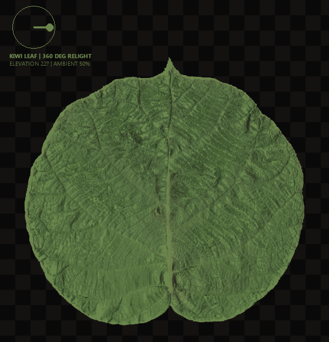

*A real 1200 dpi Kiwi leaf reconstruction, relit through 360°. The animation uses the same normal-map lighting equation as the interactive viewer.*

</div>

> [!IMPORTANT]
> LUMEN-PS began as a foliage scanner, but the method is not leaf-specific. It can recover shallow surface relief from paper, fabric, bark, pressed flowers, prints, cardboard, and other mostly diffuse subjects. Very shiny or mirror-like materials—such as polished coins—break the lighting model. Use caution with any rigid object: a raised, heavy, sharp, or oversized object can scratch or crack the scanner glass or damage the lid/mechanism.

## The idea in one minute

A flatbed scanner already contains a stable moving light and a calibrated line sensor. They sit **extremely close together**, so the lighting difference is genuinely small—easy to miss when two scans are viewed at different rotations. Crucially, however, they are **not perfectly coaxial**. That finite baseline gives the incident light a slight sideways component: a microscopic slope facing the lamp returns a little more light than the same slope facing away. With locked capture settings, registration, linearization, and four observations, that subtle but repeatable signal is enough.

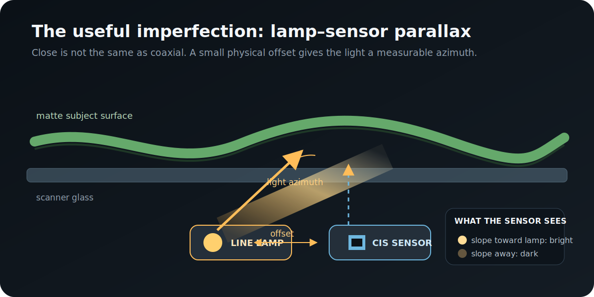

The lamp remains fixed in scanner coordinates. Rotate the subject by 90° between scans and the light appears to orbit it in subject coordinates. After the four images are aligned, each pixel has four measured intensities under four known light directions. That is enough to separate surface orientation from base color.

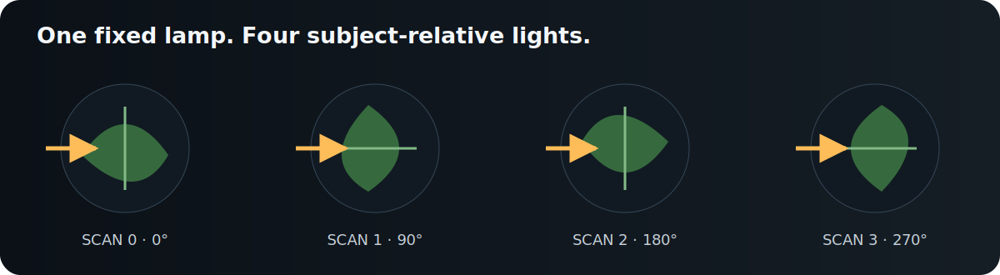

<p align="center">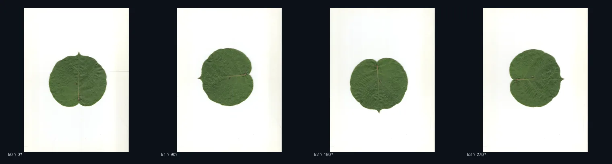</p>

## The four orientations, matched pixel-for-pixel

Rotation makes the raw captures easy to compare as objects but hard to compare as lighting measurements. LUMEN-PS de-rotates every view into the first scan's coordinate frame, then performs non-rigid registration to correct the small way a leaf or flexible subject settles after handling. In the registered images below, the tip, veins, and boundary occupy the same pixels; only illumination and capture outliers should change.

<p align="center">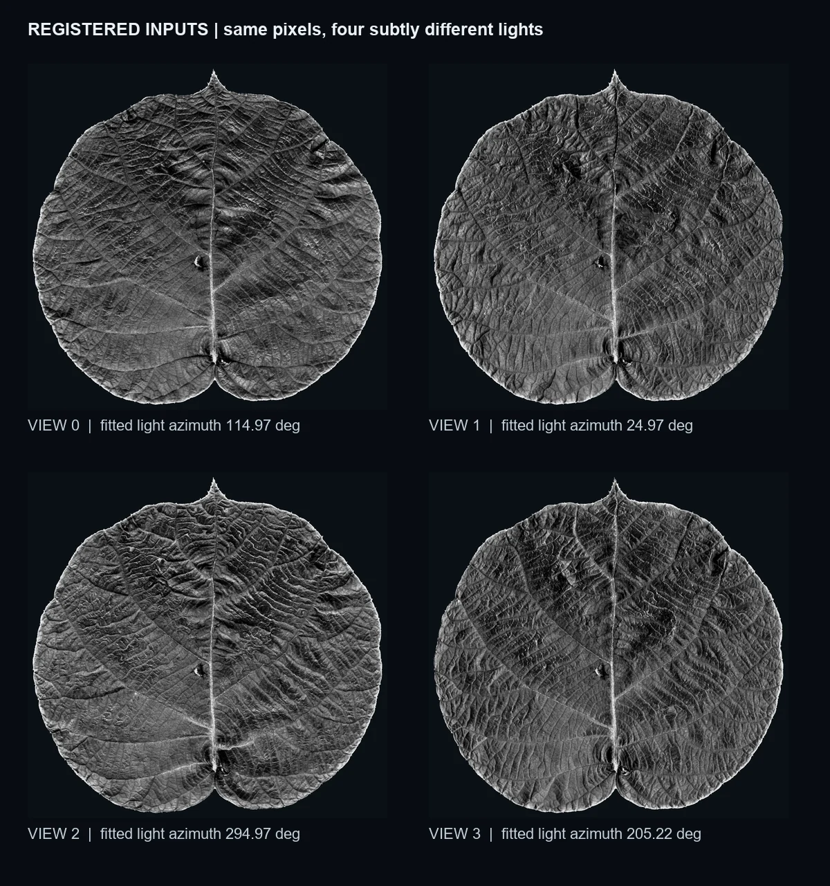</p>

Because the CIS lamp and sensor are so close, the useful difference is much smaller than the shared albedo and overall brightness. The visualization below subtracts each pixel's four-view mean and amplifies the remaining deviation **7×**. Orange means brighter than that pixel's mean; blue means darker. Opposing directional patterns across the four views are the photometric signal the solver uses—not fabricated depth or an edge filter.

<p align="center">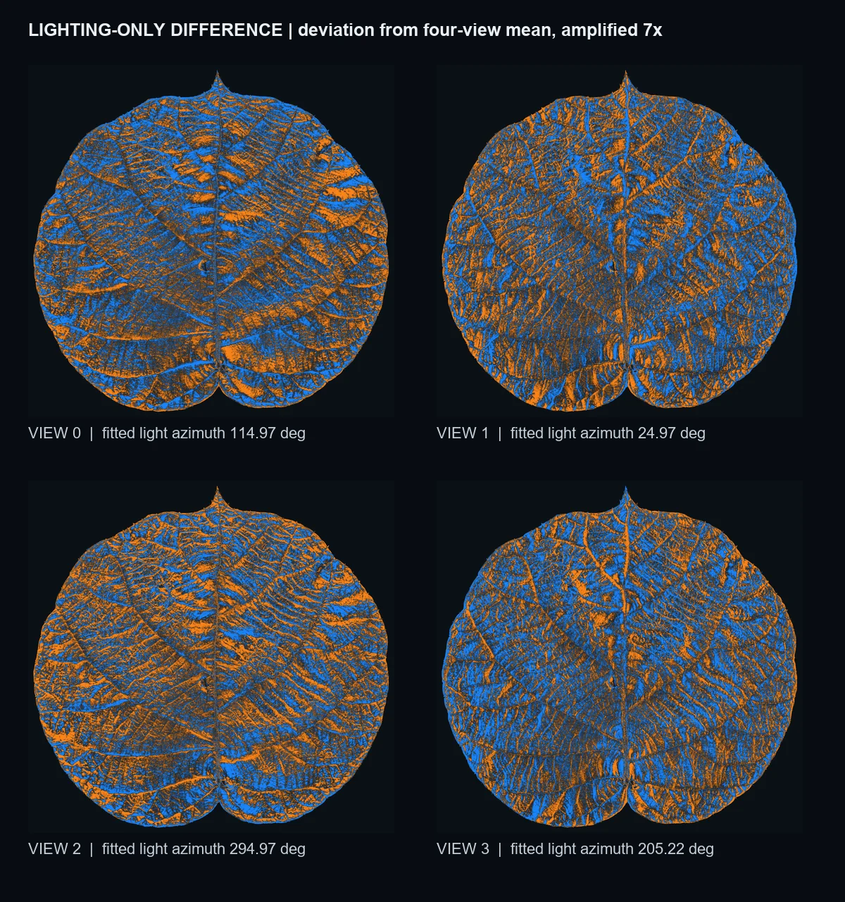</p>

## Morphing the scans into alignment

The reconstruction is only as good as its registration. Every output pixel must observe the same physical point in all four scans; any residual misalignment is interpreted by the solver as surface slope and becomes fake relief. Placing the four rotations onto one pixel grid is therefore its own small pipeline: rigid first, elastic second, with a per-pixel validity check at the end.

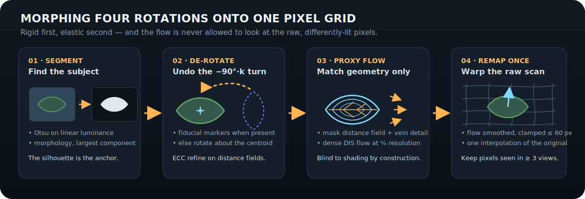

1. **Segment.** Otsu thresholding on linear luminance separates the darker subject from the bright platen background, followed by morphological cleanup and a largest-component pass. Enclosed bright regions are then filled so white paint, paper, print, and other light details remain inside the subject mask. The resulting solid silhouette anchors everything that follows.
2. **De-rotate.** When a fiducial card is present, shared ArUco markers give the rigid transform directly. Otherwise the scan is rotated by the nominal −90°·k about the subject's centroid and refined twice. First with ECC image alignment run on the masks' distance transforms rather than the images, so the refinement cannot be biased by lighting; each candidate refinement is accepted only if it does not reduce silhouette overlap, so it can never make the nominal placement worse. Then a **feature-matching pass** takes over: ORB keypoints on contrast-normalized luminance (detected away from the boundary, where per-scan shadow direction jitters the mask) are matched under a tight displacement budget and fit to a rigid transform with RANSAC, iterated to convergence. A correction is accepted only when it measurably improves dense high-pass image agreement — a lighting-robust check that catches spatially clustered false consensus. This matters because hand-placed rotations are genuinely 0.5–2° off the nominal 90° steps, an error the mask outline cannot reveal but interior texture can.
3. **Proxy flow.** A rigid transform is not enough for a leaf, a pressed flower, or fabric: handling it between rotations lets it settle slightly differently each time. Dense DIS optical flow measures that elastic deformation — but on a purpose-built proxy image, never on the raw pixels.
4. **Remap once.** The flow field is smoothed, clamped to a sane maximum displacement (600 px at full resolution by default), and applied to the full-detail original in a single interpolation, so no detail is lost to repeated resampling. Pixels that end up covered by fewer than three warped views are excluded from the solve as underdetermined.

The subtle part is what the elastic step is *not allowed to see*. Optical flow works by moving pixels until brightness matches — but between rotations, the brightness differences **are the measurement**. Run flow on the raw scans and it will happily bend the leaf until the shading agrees, silently erasing the directional signal photometric stereo depends on. So the flow is computed on a lighting-invariant proxy instead: the silhouette's distance transform provides the large-scale shape, and a high-pass of the luminance contributes vein- and texture-scale detail. Both look identical no matter where the lamp sits, so the recovered flow can only describe how the subject physically settled.

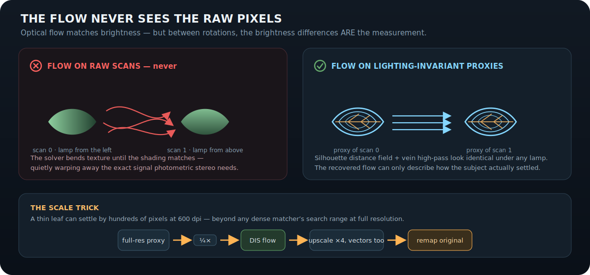

One practical trick makes this tractable at scanner resolutions: a thin subject can settle by hundreds of pixels at 600 dpi, far beyond a dense matcher's search range. The flow is therefore estimated on a quarter-scale copy of the proxy, where the same motion spans only dozens of pixels, then upscaled — vector magnitudes scaled with it — before the one full-resolution remap. The tunables live under `align` in [`leafscan/config.yaml`](leafscan/config.yaml), and the implementation is [`leafscan/align.py`](leafscan/align.py).

### Solid silhouettes and real holes

Background detection uses a **solid subject silhouette by default**. After the outside platen background is identified, any bright region fully enclosed by the subject outline remains valid. This prevents white or nearly white object details—such as white paint brushstrokes on a darker carrier—from being mistaken for background and cut out of the normal, height, albedo, and alpha results.

For genuinely perforated subjects, enable **Detect holes in subject** in the app's Process settings. This restores the earlier threshold-based behavior so the platen visible through holes is removed from the reconstruction. Use it deliberately: **the same setting can rotoscope white parts of the object**, because a white surface detail and the white platen can have similar luminance.

The equivalent configuration is:

```yaml
align:
  mask:
    # false: solid silhouette; preserves enclosed white/light object details
    # true: detect real holes, but may also remove white parts of the object
    detect_interior_holes: false
```

This mask is shared by cropping, alignment, per-pixel validity, height integration, alpha generation, the interactive preview, and exported maps, so the viewport and deliverables use the same subject boundary.

## From scans to a relightable material

| Stage | What happens | Why it matters |
|:--|:--|:--|
| **1 · Capture** | Scan at 0°, 90°, 180°, and 270° with identical exposure and color settings. | Produces four observations with different subject-relative light azimuths. |
| **2 · Linearize** | Undo sRGB gamma and optionally divide by a blank-card flat field. | Photometric stereo requires pixel values proportional to received light. |
| **3 · Register** | De-rotate using fiducials, refine rigidly with mask ECC and iterated feature matching, then correct small elastic changes. | The same output pixel must represent the same physical point in all four scans. |
| **4 · Calibrate** | Fit lamp azimuth and elevation from a calibration card or from re-render error. | The light elevation controls how strongly recovered normals tilt. |
| **5 · Solve** | Robustly solve `I = ρ(N · L)` per pixel, dropping highlight/shadow outliers. | Separates lighting-free albedo `ρ` from surface normal `N`. |
| **6 · Repair** | Detect locally inconsistent normals, identify a bad scan by leave-one-out re-solving, and selectively inpaint only unrecoverable pixels. | Removes registration/gloss artifacts without smoothing away trustworthy vein relief. |
| **7 · Integrate + verify** | Integrate the cleaned normal field into height, then re-render all four input views. | Residual images show where the model explains—or fails to explain—the measurements. |

### What comes out

| Kiwi albedo (lighting removed) | Kiwi OpenGL normal map | Kiwi integrated height |
|:--:|:--:|:--:|
| 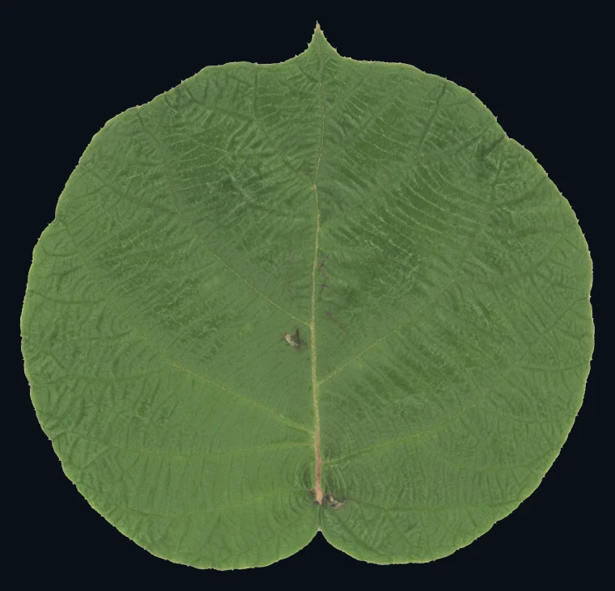 | 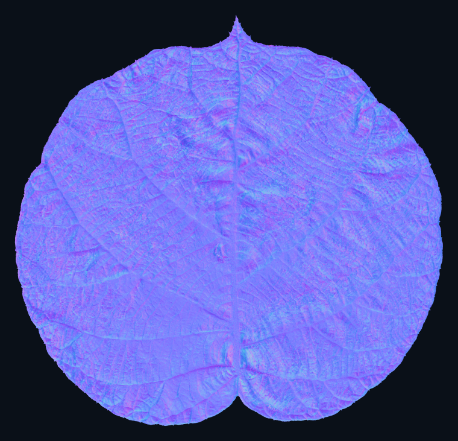 | 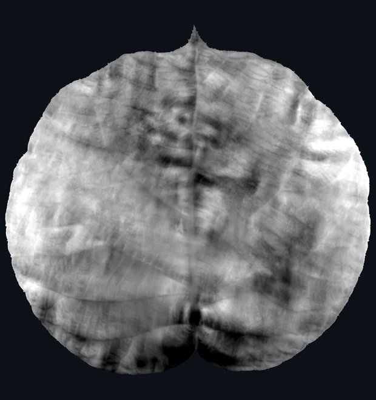 |

These previews and the relighting animation were regenerated from the filtered 1200 dpi `Kiwi Leaf` result in `sessions/kiwi-leaf-20260712-184906/out`. The height panel is contrast-mapped from its actual 16-bit `height.png`. LUMEN-PS exports `normal_gl.png`, `normal_dx.png`, linear and sRGB albedo, `height.png`, `alpha.png`, and ready-to-use RGBA albedo/normal maps. QA additionally includes `misreg_repair.png`, which records pixels re-solved from three observations and pixels that required inpainting. By default, the delivered mask is a solid silhouette that preserves enclosed white details; it is also edge-trimmed and lightly regularized (`output.edge` in the config) so per-scan shadow jitter does not serrate the alpha cutout. Full outputs remain 16-bit where useful; README images are compressed display copies only.

## Not just leaves: a rigid prototype PCB

A bare 5 × 7 cm phenolic prototyping board is close to a worst case for outline-based registration: it is rigid, rectangular, nearly symmetric, and covered in a periodic hole lattice that gives elastic matching every opportunity to lock onto the wrong grid cell. It is exactly the subject that motivated the feature-matching refinement — the recovered rotations for this run were 90.51°, −179.63°, and −89.76°, the real hand-placed offsets that centroid and silhouette methods cannot see.

<p align="center">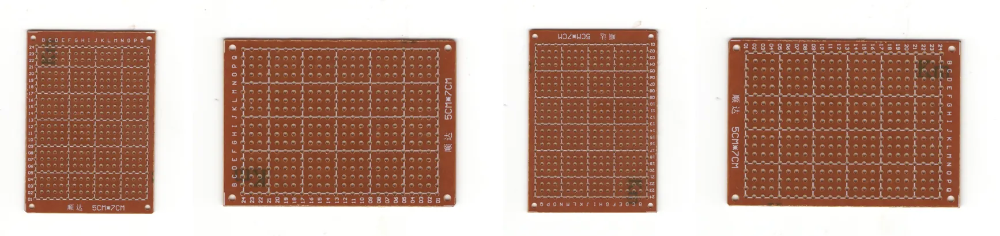</p>

The four captures above are shown exactly as the scanner delivered them: the **fast area scan** located the board in a 75 dpi preview pass and then scanned only the detected area at 1200 dpi (about 72 × 91 mm instead of the full 216 × 297 mm bed — roughly a tenth of the area, with proportionally shorter head travel and smaller files per rotation). The pipeline places each capture back at its true glass position before alignment, so the varying crops cost nothing.

| PCB albedo (lighting removed) | PCB OpenGL normal map | PCB integrated height |
|:--:|:--:|:--:|
| 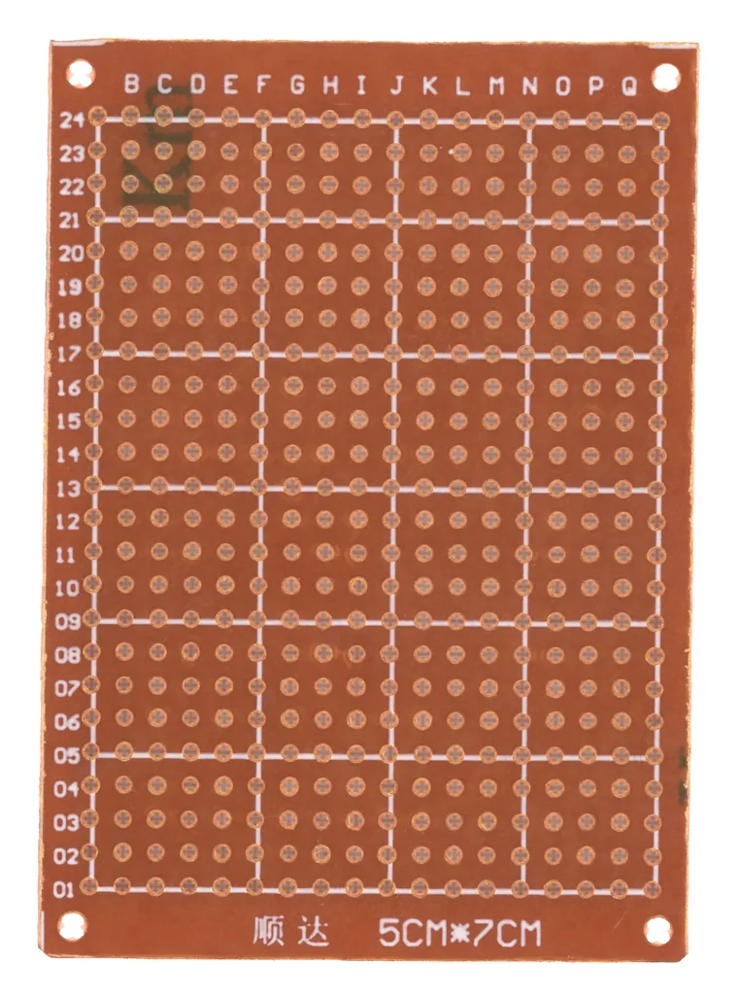 | 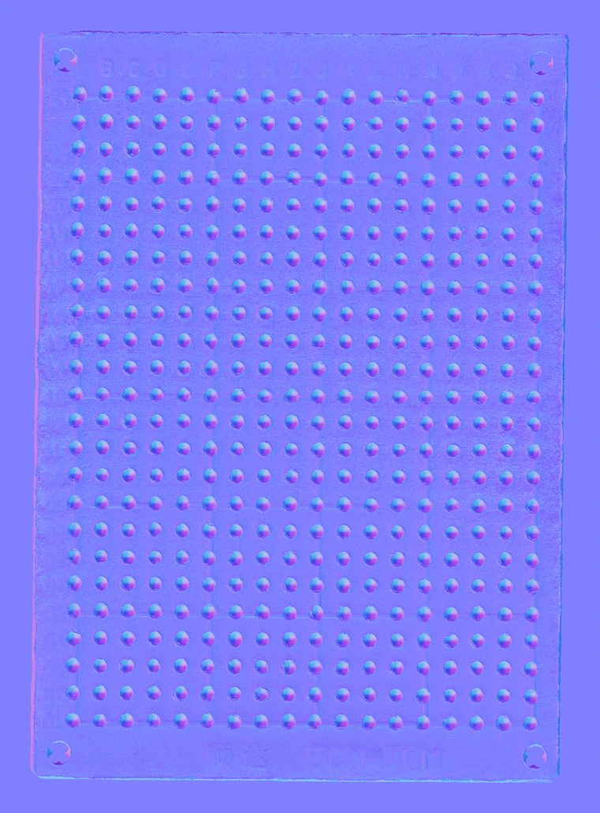 | 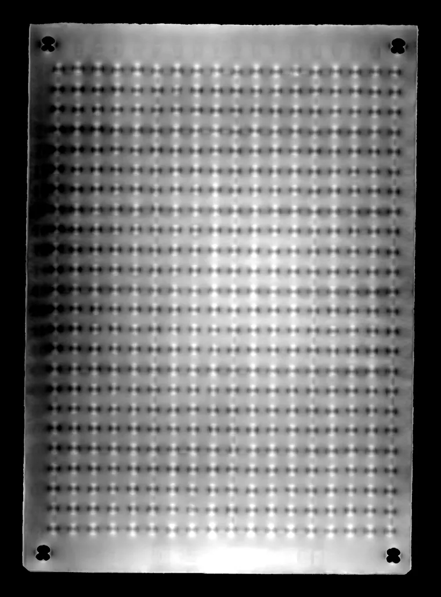 |

Every drilled hole resolves as an individual dimple in the normal map, the silkscreen grid sits flat where it should, and the height panel (contrast-mapped from the 16-bit original) shows the shallow board warp plus per-hole relief. A perforated board is a good case for enabling **Detect holes in subject**; leave it off for boards whose white silkscreen or other light surface details must remain in the reconstruction. Re-render residual means for the four scans were **0.0070–0.0131** on normalized linear intensity, from `sessions/pcb-scan-20260714-194232/out`. The usual caution stands: this board is light and smooth, but any rigid object can scratch the platen — never press one down with the lid.

<div align="center">

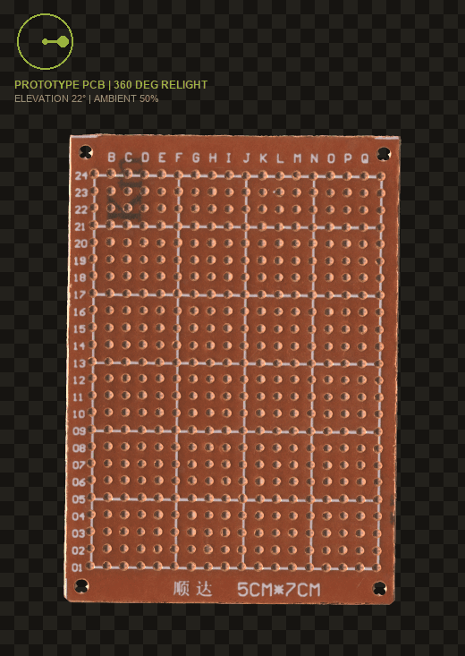

*The recovered PCB relit through 360°, rendered with the interactive viewer's shading — `albedo × (ambient + max(N·L, 0))` — every hole and solder pad responding to the orbiting light.*

</div>

## Why it works

For a mostly matte (Lambertian) point, brightness under light `k` is approximately:

```text
Iₖ = ρ max(N · Lₖ, 0)
```

`Iₖ` is measured intensity, `ρ` is lighting-independent albedo, `N` is the unknown surface normal, and `Lₖ` is the calibrated light vector. Four rotations give four equations. The solver estimates the three components of `ρN`, normalizes that vector to obtain `N`, and keeps its length as `ρ`.

Two practical details make the result far better than a textbook least-squares solve:

- **Registration is both rigid and non-rigid.** Thin subjects can settle differently after rotation; silhouette distance fields and vein/texture structure guide the correction.
- **The solve is robust.** The brightest observation can be rejected to suppress specular glints, while pixels without at least three valid samples are excluded.

## Filtering bad normal pixels without erasing real detail

Even after rigid and non-rigid registration, a flexible subject may settle a few pixels differently between rotations. A glossy vein can also violate the Lambertian model in one observation. Either case can pull a solved normal sharply sideways and create isolated specks or coherent patches. A generic blur would hide those pixels, but it would also flatten genuine veins and creases, so LUMEN-PS uses residual-guided selective repair instead.

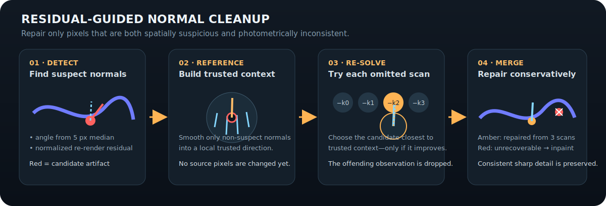

The cleanup pass works in four steps:

1. **Detect candidates.** A pixel becomes suspect when its normal differs from the local 5 px component-median field, or when its albedo-normalized re-render residual is extreme. The residual test catches coherent artifact patches that can agree with their own local median.
2. **Build trusted context.** Non-suspect neighboring normals form a smooth reference direction. Empty support is filled with bounded, linear-time nearest-supported interpolation—there is no unbounded large-kernel blur.
3. **Identify the offending observation.** For each suspect pixel, the solver tries four leave-one-out candidates (`−k0` through `−k3`). It accepts the candidate closest to trusted context only when the angular agreement improves by the configured margin.
4. **Merge conservatively.** A pixel that remains both far from trusted context and photometrically inconsistent is inpainted from its surroundings. A sharp but self-consistent normal is retained, and all repaired normals are renormalized before height integration and export.

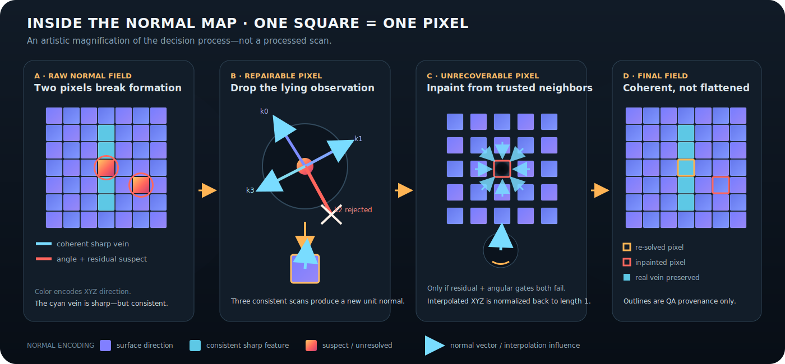

At this magnification, the distinction between the two correction paths is explicit. A **repairable pixel** still has three mutually consistent lighting observations, so the solver discards the identified outlier and computes a replacement normal from real measurements. An **unrecoverable pixel** has no trustworthy three-view solution, so only that pixel is interpolated from surrounding trusted normals and renormalized. The cyan column represents a genuinely sharp, spatially coherent vein: it survives because sharpness alone is not sufficient to trigger replacement.

<p align="center">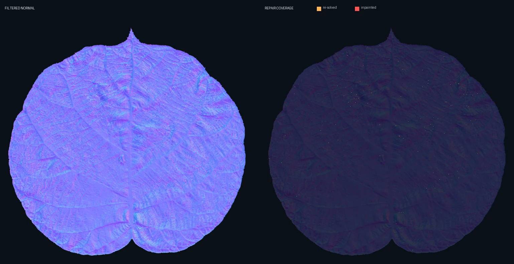</p>

The coverage view above comes from the same filtered Kiwi output shown in the result gallery. Amber marks pixels recovered from three consistent scans; red marks unrecoverable pixels selectively inpainted in the final normal and albedo fields. The darkened normal underneath makes it clear that repair is sparse and targeted rather than a whole-image smoothing pass. Thresholds live under `solve.misreg` in [`leafscan/config.yaml`](leafscan/config.yaml), and the exact coverage remains available as `out/qa/misreg_repair.png`.

## Performance and GPU architecture

The 1200 dpi pipeline can operate on tens of millions of pixels, so LUMEN-PS uses a hybrid backend instead of forcing every operation onto one processor.

| Workload | Backend in `auto` mode | Optimization |
|:--|:--|:--|
| Photometric normal solve | CPU | Four binary sample weights produce at most 16 distinct 3×3 systems. Each system is inverted once, then applied to all matching pixels—no per-pixel matrix factorization. |
| RGB albedo recovery | NVIDIA CUDA | Processes VRAM-aware row tiles, avoiding a full four-view RGB stack allocation on the GPU. |
| QA re-render + residuals | NVIDIA CUDA | Computes predicted lighting and absolute residuals in bounded tiles. |
| Height integration | NVIDIA CUDA | Runs the Frankot–Chellappa FFT in float32 on the GPU. The CPU fallback also uses float32 to halve its previous peak memory. |
| Alignment and optical flow | CPU/OpenCV | Remains CPU-side to preserve the established interpolation and registration behavior; OpenCV is capped at four threads by default so the desktop stays responsive. |
| Misregistration cleanup | Hybrid | Uses grouped solves plus a bounded neighborhood/reference pass; the previous potentially runaway widening blur is replaced by linear-time support filling. |

On an NVIDIA system, `run.bat` installs `requirements-gpu.txt` into the project virtual environment and stores compiled CUDA kernels under `.lumen-ps/cupy-cache`. GPU tiles are sized from currently free VRAM, cached allocations are released between stages, and `auto` falls back to the optimized CPU path if CUDA is unavailable or a tile cannot fit. This supports smaller laptop GPUs such as the tested 4 GB RTX 3050 without reserving VRAM needed by the browser or Windows desktop.

The backend is configurable in [`leafscan/config.yaml`](leafscan/config.yaml):

```yaml
runtime:
  compute: "auto"   # auto | cpu | gpu
  cpu_threads: 4    # OpenCV alignment thread cap
```

`auto` is recommended: it keeps the tiny grouped linear systems on the faster CPU path while sending large array and FFT workloads to CUDA. `cpu` disables CUDA completely; `gpu` forces every supported operation onto CUDA and is mainly useful for profiling. CUDA and CPU paths feed the same normal, albedo, height, preview, QA, and export code, so acceleration does not create a separate rendering result.

## Fast area scan and memory-aware cropping

Scanning the full bed four times at 1200 dpi is slow and produces four ~350-megapixel-bed images that are mostly empty platen. Two cooperating features keep both the scanner and the solver working only on the subject:

**Fast area scan** (`capture.smart_roi`) runs a quick 75 dpi locator pass over the whole bed, detects the subject against the platen background, and then performs the high-dpi detail scan over just the detected area plus a safety margin (10 mm by default). Detection deliberately ignores anything hugging the preview border — the bed edge, calibration strip, and lid seam leave dark slivers there that would otherwise balloon the region to the full bed. Because scanner drivers snap scan windows to their own grid (the tested HP rounds extents up to multiples of 8 px), the session records the rectangle the driver *actually* scanned, not the requested one, along with the dpi each capture used.

**Auto crop** (`runtime.auto_crop`) closes the loop at processing time. Each ROI capture is placed back at its true glass position, reconstructing one consistent bed coordinate frame for alignment and flat-fielding. The common content window is computed first from coarse masks in bed coordinates, so only that window is ever assembled — full-bed-sized canvases are never allocated, and the full-resolution solve stays within memory even at 1200 dpi.

For the PCB example above this meant ~20 MB per capture, the scan head stopping right after the board on every pass, and a working canvas barely larger than the board itself instead of four padded full-bed frames.

### Details hidden inside the simple idea

- **Four scans are deliberate.** Two intensity measurements cannot determine a three-component scaled normal. Three is the mathematical minimum; the fourth gives the solver room to reject one highlight or shadow and still remain determined.
- **The four lights lie on one cone.** Rotation changes azimuth, not elevation. A wrong elevation can still produce plausible-looking normals with systematically exaggerated or flattened relief, so LUMEN-PS fits elevation instead of guessing it.
- **The scanner is repeatable in ways a hand-held camera is not.** Focus, sensor path, working distance, and lamp-to-sensor geometry are mechanically fixed on every pass.
- **Color contains an extra botanical clue.** For leaves, red light penetrates tissue more deeply than blue. LUMEN-PS writes an `R − B` subsurface hint for QA or shading experiments, but deliberately does not let it drive the normal solve. This leaf-specific bonus is optional; the core reconstruction works on other diffuse subjects.
- **Normals and height answer different questions.** The normal map is the direct photometric result and preserves fine local slope. Height is obtained by integrating that slope field, so it is useful for relief but more sensitive to low-frequency drift and boundary conditions.
- **Sixteen-bit normals matter here.** The lamp–sensor baseline is small, so many recovered slopes differ by fine increments that would band more readily in an 8-bit deliverable.

### The reconstruction checks its own work

The recovered albedo and normals are rendered back under each fitted scanner light. If prediction and observation agree, the residual is dark and noise-like. Structured bright areas reveal misregistration, gloss, shadows, bad flat-fielding, or an incorrect light elevation.

| Observed scan | Predicted from recovered maps | Absolute residual |
|:--:|:--:|:--:|
| 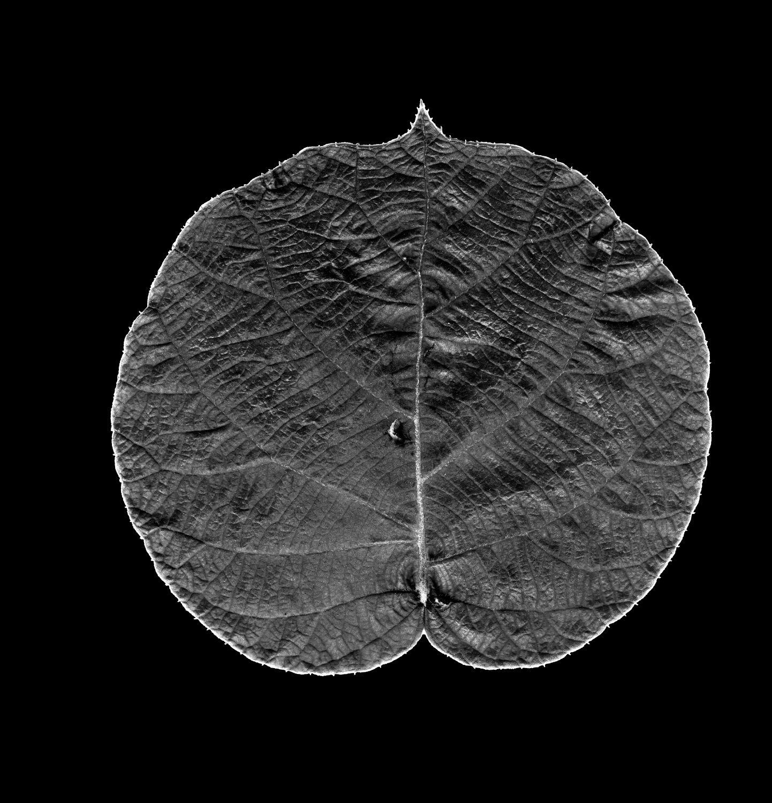 | 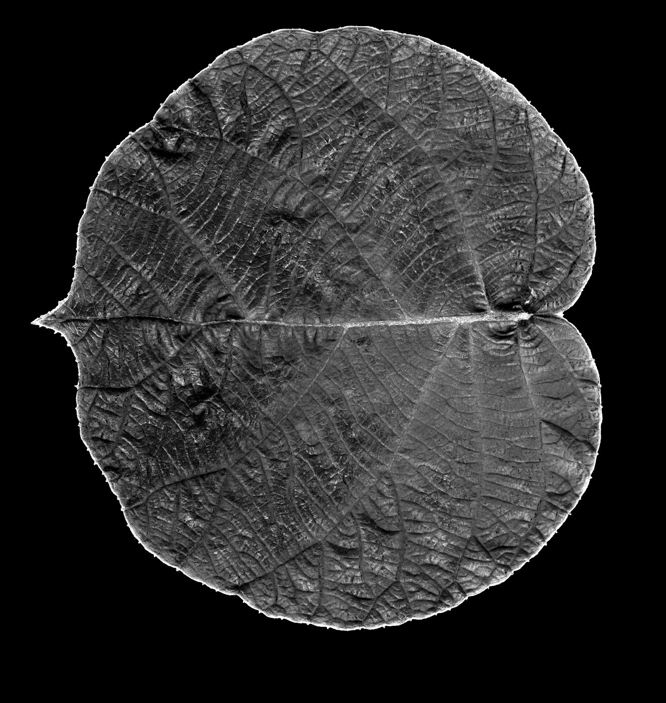 | 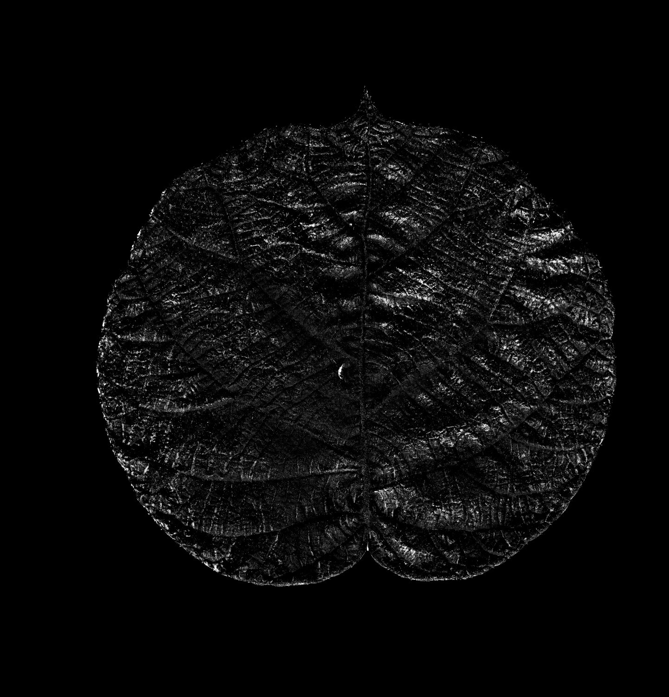 |

The current filtered Kiwi run has mean residuals of **0.0092–0.0099** on normalized linear intensity. See [`docs/`](docs/) for all four observed, predicted, and residual views plus mask agreement, rejection coverage, and the new misregistration-repair coverage.

## Will my printer/scanner work?

The printer portion is irrelevant; LUMEN-PS needs a compatible **flatbed scanner**. An all-in-one printer is suitable only if its flatbed meets these requirements.

| Requirement | Needed | Notes |
|:--|:--:|:--|
| Windows driver exposed through **WIA 2.0** | **Yes** | Current automatic capture is Windows/WIA. CLI processing can operate on suitable lossless scans captured another way. |
| Flatbed platen | **Yes** | Sheet-fed/ADF scanners cannot keep and rotate the subject on a common plane. |
| Directional, repeatable moving lamp | **Yes** | CIS units commonly have the useful lamp–sensor offset; verify by comparing highlights in 0° and 90° scans. |
| Manual or lockable brightness/contrast/color | **Strongly recommended** | All four scans need identical processing. Disable auto exposure/color, sharpening, and enhancement where the driver allows it. |
| 24-bit color, lossless PNG/TIFF | **Yes** | Never feed JPEG captures to the reconstruction. The tested HP WIA driver is 8-bit per channel, so LUMEN-PS linearizes sRGB in software. |
| 600 dpi or higher optical resolution | **Recommended** | 1200 dpi is supported and captures fine relief; 600 dpi is faster and often sufficient. |
| Enough platen clearance | **Yes** | The subject and fiducial card must lie flat without forcing the lid or loading the glass. |

Verified hardware: **HP LaserJet Professional M1130/M1132 MFP**, USB, WIA 2.0, at 75–1200 dpi. Other devices are expected to work when they meet the physical and capture requirements, but should pass the directional-light test before a full run.

## What scans well?

| Good candidates | Challenging / unsupported |
|:--|:--|
| Leaves and pressed flowers | Polished coins, foil, glossy plastic, wet surfaces |
| Paper, prints, cardboard, embossed stock | Transparent or translucent objects without a diffuse surface |
| Bare prototype PCBs and other matte, flat rigid boards (see the PCB example; handle the platen with care) | Populated boards with tall or sharp components |
| Fabric, leather, thin bark, flat natural textures | Deep objects that cast strong shadows or cannot remain registered |
| Shallow relief and mostly matte craft materials | Anything sharp, heavy, hot, dirty, or likely to damage the platen |

The mathematical model assumes mostly diffuse reflection and shallow relief. Mild highlights are handled by outlier rejection; dominant reflections are not. When in doubt, protect the scanner and use a disposable matte carrier card—never press a rigid object down with the lid.

## Quick start

### Windows app

1. Install [Python 3.11 or newer](https://www.python.org/downloads/).
2. Connect the scanner and install its WIA driver.
3. Double-click `run.bat`.

The launcher creates an isolated `.venv`, installs dependencies, starts the local LUMEN-PS bench, and opens `http://127.0.0.1:8756`. In the app: create a session, capture four rotations, process, then drag the light around the interactive result. The Process screen keeps **Detect holes in subject** off by default; enable it only when the subject has real cutouts and heed the warning about white object details.

If an NVIDIA GPU is detected, the first launch also installs the project-local CUDA runtime, cuBLAS, and cuFFT packages. This is a large one-time download; no system-wide CUDA Toolkit installation is required. Systems without a compatible NVIDIA GPU continue with the optimized CPU backend.

### Command line

```powershell
python -m venv .venv
.venv\Scripts\Activate.ps1
pip install -r requirements.txt
# Optional NVIDIA CUDA backend:
pip install -r requirements-gpu.txt

python -m leafscan.cli capture --preview
python -m leafscan.cli capture --out scans\sample\k0.png --dpi 600 --color
# Rotate the subject and repeat for k1.png, k2.png, and k3.png.

python -m leafscan.cli run --scans scans\sample --out out
```

Optional references:

- `flat.png`: blank scan of the same matte carrier card for flat-field correction.
- `calib0.png`, `calib90.png`: single-face corrugated cardboard at 0°/90° for light-elevation fitting. Without them, elevation is self-calibrated from re-rendering residuals.

## Reading QA

- **Low, noise-like residual:** the model explains the scan; trust is high.
- **Bright veins or isolated sparkles:** specular leakage; tighten outlier rejection.
- **Gray/white areas in `misreg_repair.png`:** gray was repaired by dropping one bad observation; white required selective inpainting.
- **Large smooth gradient:** flat-field correction or light elevation is wrong.
- **Residual tracing the outline:** rigid/non-rigid registration failed.
- **Fewer than 3 valid views:** that pixel is underdetermined and excluded.

## Development

```powershell
python -m pytest tests -q
# or
python -m leafscan.cli selftest
```

The implementation is organized into `io`, `lights`, `align`, `calibrate`, `solve`, `cleanup`, `compute`, `integrate`, `outputs`, and `qa`, with the WIA capture bridge and FastAPI/WebGL UI alongside them. Tunable values live in [`leafscan/config.yaml`](leafscan/config.yaml). The detailed derivation and design rationale live in [`scanner_photometric_stereo_spec.md`](scanner_photometric_stereo_spec.md).

## License

LUMEN-PS is released under the [MIT License](LICENSE).

---

<div align="center"><sub>Built from the observation that a scanner is already a remarkably repeatable moving light stage—it only needed four turns and the right inverse problem.</sub></div>
